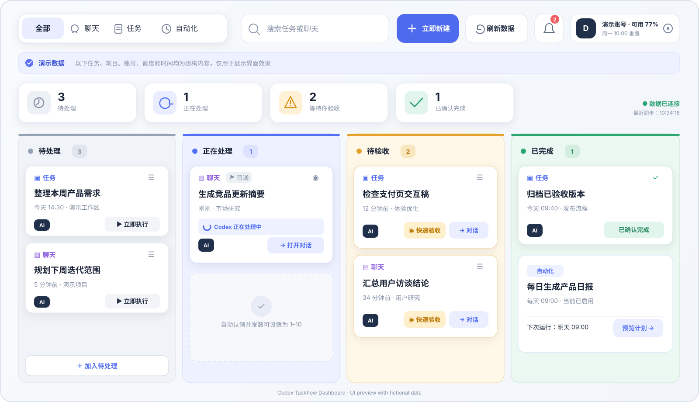

<div align="center">

# Codex Taskflow Dashboard

**固定在 Codex 桌面端侧边栏的任务、聊天与自动化看板**

[安装](#安装) · [功能](#功能) · [工作方式](#工作方式) · [卸载与恢复](#卸载与恢复)

</div>

Codex Taskflow Dashboard 把当前 Codex 账号中的任务、聊天和计划任务整理成四列看板：**待处理、正在处理、待验收、已完成**。它直接嵌入 Codex 桌面端，不需要切换到独立网页。

<p align="center">
  
</p>

<p align="center"><sub>界面效果示意图；任务、项目、账号、额度和时间均为虚构数据。</sub></p>

> [!IMPORTANT]
> 固定侧边栏入口目前仅支持 macOS Codex 桌面端。这是社区扩展，通过本机回环调试端口注入界面，并非 OpenAI 官方插件 API；Codex 桌面端升级后可能需要更新本项目。

## 功能

- 固定在 Codex 左侧导航栏，侧边栏收起后仍保留展开入口。
- 全部、聊天、任务、自动化四个视图，自动记住上次选择。
- 支持搜索、拖拽将“待处理”启动为“正在处理”、将“待验收”确认为“已完成”，以及通知、快速验收和跳转到对应 Codex 对话。
- 加入待处理时可按 Codex 项目名称选择“在项目中处理”，也可选择“不需要项目”；界面不会要求用户理解或填写本机目录。
- 运行结束后自动从“正在处理”进入“待验收”。
- “正在处理”使用不确定进度 loading，避免伪造任务完成比例，并可直接打开对应对话。
- 卡片展示高、普通、低优先级；通过待处理队列创建时可设置并跟随到真实 Codex 对话。
- 当天之外的非运行任务默认归为“已完成”，已完成列仅保留最近 7 天更新的内容。
- 可定时逐个认领“待处理”事项，真实创建并启动 Codex 任务；自动认领同时处理数可设置为 1–10，默认 5。
- 看板列固定高度、列内滚动，并使用颜色区分状态。
- 额度仅展示本机 Codex 实际返回的使用信息；读取不到时会明确显示不可用，不伪造百分比。
- “已完成”是本地验收状态，不会停止、删除或修改 Codex 自动化计划。

## 安装

最简单的方法是把下面这句话发给 Codex：

```text
请按照仓库根目录 SKILL.md 安装并验证这个项目：https://github.com/dengzi77/codex-taskflow-dashboard
```

也可以手动安装：

```bash
git clone https://github.com/dengzi77/codex-taskflow-dashboard.git "$HOME/.local/share/codex-taskflow-dashboard"
cd "$HOME/.local/share/codex-taskflow-dashboard"
./install.sh
```

安装器会：

1. 检查 Node.js 22.5+，缺失时下载并校验 Node.js 官方运行时；
2. 安装依赖并构建本地界面；
3. 安装 `taskctl`；
4. 将官方 Codex 应用安全保存在 `/Applications/Codex.app`；
5. 在 `/Applications/ChatGPT.app` 安装同图标启动器并重新打开 Codex。

安装过程不会修改官方应用包内部文件，也不需要 `sudo`。

## 工作方式

```text
Codex 桌面端
  └─ 本机侧边栏界面
       ├─ Codex App Server：任务、聊天、自动化、真实额度
       └─ .data：本机验收状态、队列设置、通知状态
```

- 所有连接只监听 `127.0.0.1`。
- Git 仓库不包含用户数据；`.data/` 已被忽略。
- 自动更新先在独立目录下载、安装和构建，通过健康检查后才切换版本，并保留 `.data/`。
- 默认服务端口为 `47823`，Codex 调试端口为 `9231`。可分别使用 `CODEX_TASKBOARD_PORT` 和 `CODEX_TASKFLOW_DEBUG_PORT` 修改。

## 更新

运行中的看板默认每五分钟检查 `main` 分支更新。也可以手动更新：

```bash
cd "$HOME/.local/share/codex-taskflow-dashboard"
git pull --ff-only
npm ci
npm run build:web
npm run codex:install-launcher -- --launch
```

## 卸载与恢复

```bash
cd "$HOME/.local/share/codex-taskflow-dashboard"
npm run codex:uninstall-launcher
```

这会移除社区启动器，并将保存的官方 Codex 应用恢复到 `/Applications/ChatGPT.app`。项目目录和 `.data/` 不会自动删除，避免误删任务状态；确认不再需要后可自行移除。

如果 Codex 无法启动，也可直接打开保存的官方应用：

```bash
open "/Applications/Codex.app"
```

## 开发

```bash
npm ci
npm run release:check
```

常用命令：

- `npm run dev`：启动本地开发服务。
- `npm run codex:inject`：注入已经以调试端口启动的 Codex。
- `npm test`：运行 Node 测试。
- `npm run typecheck`：运行 TypeScript 检查。

## 兼容性与风险

- 需要 macOS 13+、Codex 桌面端和网络连接（首次安装依赖及检查更新）。
- 由于侧边栏并非 Codex 当前公开的插件扩展点，桌面端 DOM 或 App Server 协议变化可能导致功能暂时失效。
- 本项目不会绕过 Codex 账号权限，也不会提供额外额度；所有可执行任务仍受使用者账号和本机 Codex 能力限制。

## 开源协议与致谢

本项目基于 [MIT License](LICENSE) 发布，派生自 [ElliotHughes/codex-one-person-board](https://github.com/ElliotHughes/codex-one-person-board)。完整来源说明见 [NOTICE.md](NOTICE.md)。
